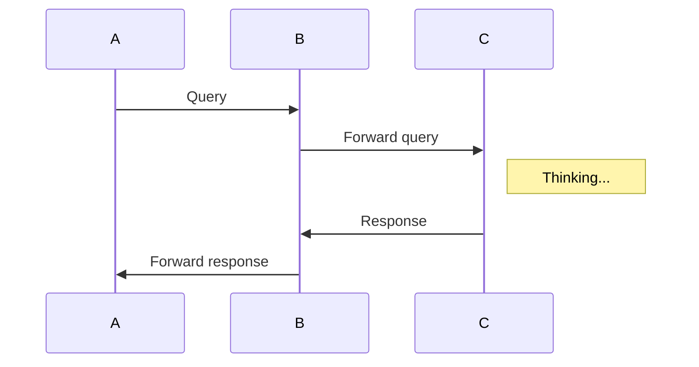
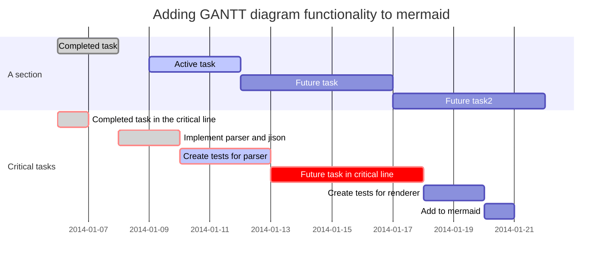

# 常用语法

___

## 标题

```markdown
这是 H1 一级标题
======
这是 H2 二级标题
------
# 这是 H1 一级标题
## 这是 H2 二级标题
### 这是 H3 三级标题
#### 这是 H4 四级标题
##### 这是 H5 五级标题
###### 这是 H6 六级标题
```

## 列表
### 无序列表
```markdown
* 项目1
  * 子项目1.1
  * 子项目1.2
    * 子项目1.2.1
* 项目2
* 项目3

+ 项目1
  + 子项目1.1
  + 子项目1.2
    + 子项目1.2.1
+ 项目2
+ 项目3

- 项目1
  - 子项目1.1
  - 子项目1.2
    - 子项目1.2.1
- 项目2
- 项目3
```

### 有序列表
```markdown
1. 项目1
2. 项目2
3. 项目3
    1. 项目3.1
    2. 项目3.2

1. 项目1
1. 项目2
1. 项目3
    1. 项目3.1
    1. 项目3.2
```
### 有序列表起始编号
```markdown
58. 项目5
2. 项目6
```
**快捷键**: [ctrl + o]


## 链接
```markdown
[链接名称](链接地址)
[链接名称][1]
[1] : 链接地址
```


## 图片
```markdown

![名称][1]
[1] : 链接地址
```


## 文字格式
```markdown
**这是文字粗体格式**

__这是文字粗体格式__

*这是文字斜体格式*

_这是文字斜体格式_
```


## 引用
```markdown
> 第一行引用文字
> 第二行引用文字
```


## 水平线
```markdown
***
```

___

# GFM扩展语法

___

## 表格
```markdown
First Header  | Second Header
------------- | -------------
Content Cell  | Content Cell
Content Cell  | Content Cell
```


## 增强型表格
```markdown
|First Header  | Second Header ||
|First Header  | Second Header | Third Header|
|------------- | -------------|-------------|
表身1Content Cell  | Merge Content Cell||
Content Cell  | Content Cell| Content Cell|

表身2Content Cell  | Merge Content Cell||
Content Cell  | Content Cell| Content Cell|
[表格标题]
```


## 代码
### 行内代码
```markdown
`var x = "hello world"`
```
### 块代码
````markdown
```javascript
var a = "hello world";
var b = "good luck";
```
````


## 自动转换成超链接
系统将自动根据内容，将地址转换成超链接格式
```markdown
http://markdown.xiaoshujiang.com
```


## HTML
```markdown
<div class="hey">Hello world</div>
```
[支持的html标签](https://github.com/github/markup/tree/master#html-sanitization)


## 删除线
```markdown
~~在文字上添加删除线~~
```

___

# 扩展语法

___

## 目录
```markdown
[toc]
```


## 扩展的文字格式
```markdown
++插入的文字++

==被记号的文字==

上角文字: 19^th^

下角文字: H~2~O
```


## 印刷字替换
系统将自动替换下列文字，转换成排版系统使用的符号
```markdown
(c) (C) (r) (R) (tm) (TM) (p) (P) +-
```


## 缩写定义
```markdown
The HTML specification
is maintained by the W3C.
*[HTML]: Hyper Text Markup Language
*[W3C]:  World Wide Web Consortium
```


## 待办事项
```markdown
- [ ] 未完成事项
- [ ] 未完成事项
- [x] 完成事项
- [X] 完成事项
```


## 脚注
```markdown
脚注[^1x]
[^1x]: 脚注的用法
```


## 定义
```markdown
苹果
: 一种水果
: 一种品牌，计算机，手持设备
桔子
: 一种水果
```


## 公式

### 行内公式
```markdown
这是行内公式`!$ \Gamma(z) = \int_0^\infty t^{z-1}e^{-t}dt\,. $`
```
### 块公式
````markdown
```mathjax!
$$\Gamma(z) = \int_0^\infty t^{z-1}e^{-t}dt\,.$$
```
````


### 流程图 ([语法](http://adrai.github.io/flowchart.js/))
````markdown
```flow
st=>start: 开始
e=>end: 结束
op=>operation: 操作步骤
cond=>condition: 是 或者 否?

st->op->cond
cond(yes)->e
cond(no)->op
```
````


### 序列图 ([语法](https://github.com/bramp/js-sequence-diagrams/blob/master/src/grammar.jison))
````markdown
```sequence
小明->小李: 你好 小李, 最近怎么样?
Note right of 小李: 小李想了想
小李-->小明: 还是老样子
```
````

___

# 示例

___

[toc]

# 这是 H1 一s级标题
## 这是 H2 二级标题
### 这是 H3 三级标题
#### 这是 H4 四级标题
##### 这是 H5 五级标题
###### 这是 H6 六级标题


### 待办事项
- [ ] 未完成事项
- [x] 完成事项
- [X] 完成事项

### 缩写定义

The HTML specification
is maintained by the W3C.

*[HTML]: Hyper Text Markup Language
*[W3C]:  World Wide Web Consortium

### 印刷字替换

(c) (C) (r) (R) (tm) (TM) (p) (P) +-

### html代码

<div>html代码</div>

### 流程图 ([语法](http://adrai.github.io/flowchart.js/))

```flow
st=>start: 开始
e=>end: 结束
op=>operation: 操作步骤
cond=>condition: 是 或者 否?

st->op->cond
cond(yes)->e
cond(no)->op
```

### 序列图 ([语法](https://github.com/bramp/js-sequence-diagrams/blob/master/src/grammar.jison))

```sequence
小明->小李: 你好 小李, 最近怎么样?
Note right of 小李: 小李想了想
小李-->小明: 还是老样子
```

### 脚注[^1x]

[^1x]: 脚注的用法

### 表格Tables

First Header  | Second Header
------------- | -------------
Content Cell  | Content Cell
Content Cell  | Content Cell

### 定义

苹果
: 一种水果
: 一种品牌，计算机，手持设备

桔子
: 一种水果

### 文字格式

**这是文字粗体格式**

__这是文字粗体格式__

*这是文字斜体格式*

_这是文字斜体格式_

~~在文字上添加删除线~~

++插入的文字++

==被记号的文字==

上角文字: 19^th^

下角文字: H~2~O

### 无序列表

* 项目1
  * 子项目1.1
  * 子项目1.2
    * 子项目1.2.1
* 项目2
* 项目3

### 有序列表

1. 项目1
2. 项目2
3. 项目3
    1. 项目3.1
    2. 项目3.2

### 有序列表起始编号

58. 项目5
2. 项目6

### 图片


链接

[链接名称](http://xiaoshujiang.com)
### 引用

> 第一行引用文字
> 第二行引用文字
### 水平线

***
### 代码

#### 行内代码

`var x = "hello world"`

#### 块代码

```java
/**
 * @author John Smith <john.smith@example.com>
 * @version 1.0
*/
package l2f.gameserver.model;

import >>++java.util.ArrayList++<<;

>>~~public abstract class L2Character {~~<<
>>++public abstract class L2Character extends L2Object {++<<
  public static final Short ABNORMAL_EFFECT_BLEEDING = 0x0_0_0_1; // not sure

  public void moveTo(int x, int y, int z) {
    _ai = null;
    _log.warning("Should not be called");
    if (1 > 5) {
      return;
    }
  }

  /** Task of AI notification */
  @SuppressWarnings( { "nls", "unqualified-field-access", "boxing" })
  >>==public class NotifyAITask implements Runnable {
    private final CtrlEvent _evt;

    List<String> mList==<< = new ArrayList<String>()

    public void run() {
      try {
        getAI().notifyEvent(_evt, _evt.class, null);
      } catch (Throwable t) {
        t.printStackTrace();
      }
    }
  }
}
```

### 公式
#### 行内公式
这是行内公式$ \Gamma(z) = \int_0^\infty t^{z-1}e^{-t}dt\,. $

#### 块公式
$$\Gamma(z) = \int_0^\infty t^{z-1}e^{-t}dt\,.$$

$$\int_0^\infty \frac{x^22}{e^x-1}\,dx = \frac{\pi^4}{15}$$


### mermaid流程图，序列图，甘特图


#### 流程图


#### 序列图



#### 甘特图



### emoji表情[语法](https://github.com/twitter/twemoji)

> Classic markup: :wink: :crush: :cry: :tear: :laughing: :yum:
>
> Shortcuts (emoticons): :-) :-( 8-) ;)
> 
> [emoji表情清单：《Emoji cheat sheet for GitHub, Basecamp and other services》](https://www.webfx.com/tools/emoji-cheat-sheet/)